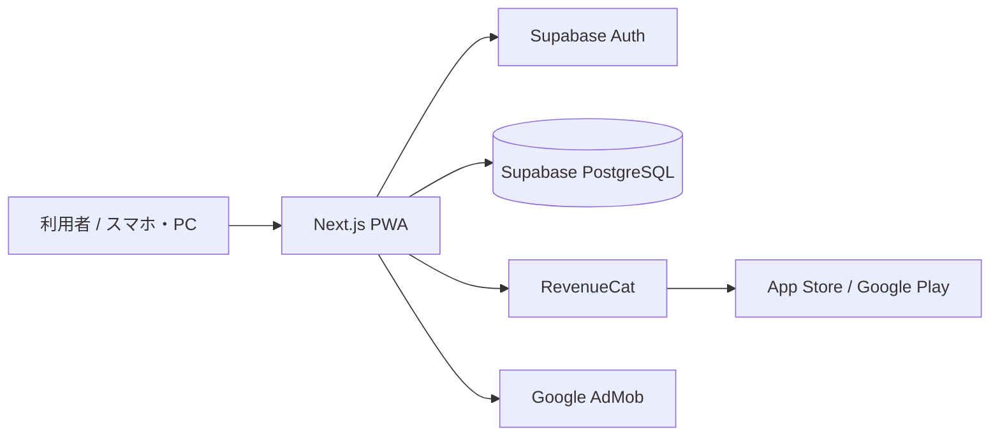
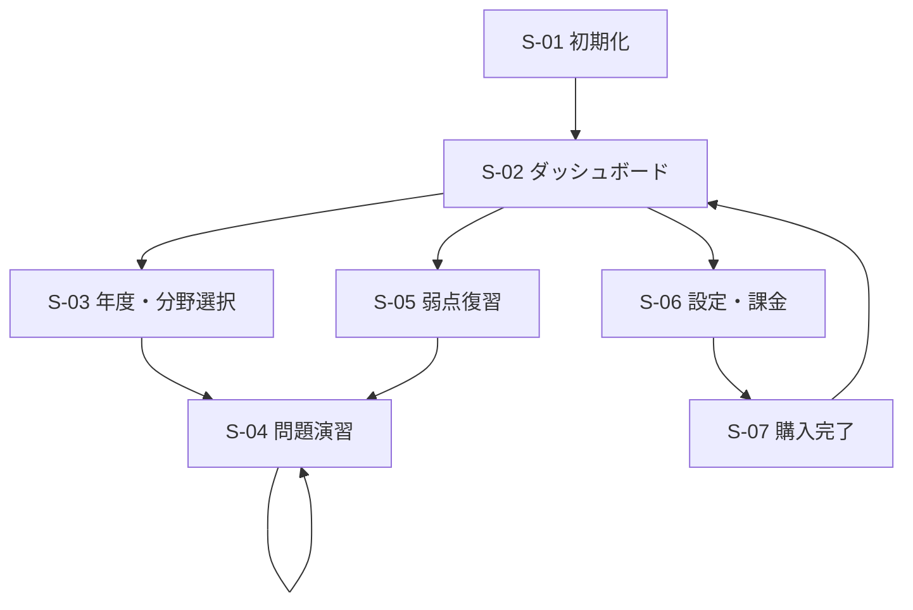
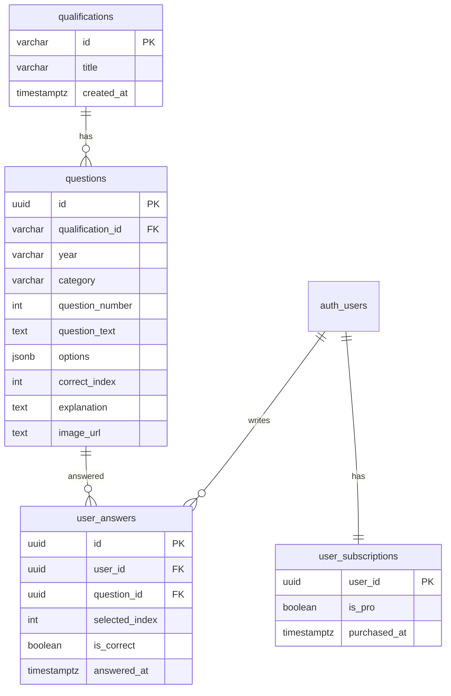

# 基本情報技術者試験 過去問アプリ 基本設計書

| 項目 | 内容 |
| --- | --- |
| 文書名 | 基本設計書 |
| 対象システム | 基本情報技術者試験 過去問アプリ |
| 版数 | 1.0 |
| 作成日 | 2026-09-13 |
| 前提文書 | 基本情報技術者試験_過去問アプリ_要件定義書.pdf |

---

## 1. 文書の目的

本書類は要件定義書を受け、実装に入る前に確定すべき以下を定義する。

- システム全体の構成と責務分担
- 画面構成と画面遷移
- 機能の入出力と処理方針
- データベース論理設計
- 外部サービス連携方針
- セキュリティ・非機能要件の方針

詳細なモジュール分割、SQL、コンポーネント実装は『詳細設計書』で定義する。

---

## 2. システム概要

### 2.1 目的

基本情報技術者試験の過去問演習と弱点分析を提供する、モバイル対応 Web アプリ（PWA / ネイティブ変換前提）を構築する。資格マスタを分離し、毒物劇物取扱者・潜水士など他資格アプリへ水平展開できるテンプレートとする。

### 2.2 提供価値

| 区分 | 内容 |
| --- | --- |
| 無料ユーザー | 直近年度の問題のみ演習可能。画面下部に広告を表示する |
| 有料ユーザー（Pro） | 全年度・全問題を開放し、広告を非表示にする（単発買い切り） |
| 共通 | 4択即時判定、解説表示、ダッシュボード、弱点復習 |

### 2.3 想定利用者

| 利用者 | 利用目的 |
| --- | --- |
| 受験者 | 過去問演習、正答率確認、弱点復習 |
| 運営者 | 問題投入、課金・広告の運用、他資格への展開 |

---

## 3. システム構成

### 3.1 全体構成

### 3.2 技術スタック

| 層 | 採用技術 | 責務 |
| --- | --- | --- |
| フロントエンド | Next.js (App Router), TypeScript, Tailwind CSS | 画面描画、演習 UI、PWA |
| 認証 | Supabase Auth | 匿名ログイン、メール等の本登録 |
| データベース | Supabase PostgreSQL | 資格・問題・解答・課金状態の永続化 |
| 課金 | RevenueCat | 単発購入の検証と Pro 状態の同期 |
| 広告 | Google AdMob | 無料ユーザー向けバナー広告 |

### 3.3 責務分担

| コンポーネント | 行うこと | 行わないこと |
| --- | --- | --- |
| Next.js クライアント | UI、入力検証、即時正誤表示、広告表示制御 | 正解判定の最終権威（DB の `correct_index` を正とする） |
| Next.js サーバ（Route Handler / Server Action） | 認可、問題公開範囲の制御、解答保存、課金状態更新 | 決済そのものの課金処理 |
| Supabase | 認証、RLS によるデータ保護、永続化 | 画面制御 |
| RevenueCat | 購入検証、エンタイトルメント管理 | 問題データの保持 |
| AdMob | 広告配信 | 課金判定 |

---

## 4. 機能一覧

| ID | 機能名 | 概要 | 対象 |
| --- | --- | --- | --- |
| F-01 | 匿名ログイン | 登録なしで演習開始できる | 全ユーザー |
| F-02 | アカウント登録 / ログイン | 匿名ユーザーの引き継ぎ、または通常ログイン | 全ユーザー |
| F-03 | ダッシュボード | 総解答数、正答率、シラバス分野別達成度を表示 | ログイン済 |
| F-04 | 問題演習 | 4択、即時判定、解説表示 | ログイン済 |
| F-05 | 無料範囲制限 | `is_pro = false` は直近年度のみ開放 | 無料ユーザー |
| F-06 | 広告表示 | 演習画面下部にバナー広告 | 無料ユーザー |
| F-07 | 弱点復習 | 直近の誤答問題を自動出題 | ログイン済 |
| F-08 | 全問解放購入 | 「全問題解放＆広告非表示」を単発購入 | 無料ユーザー |
| F-09 | 設定 | アカウント、課金状態、ログアウト | ログイン済 |
| F-10 | 資格切替（将来） | `qualifications` による他資格展開の受け口 | 将来拡張 |

---

## 5. 画面設計

### 5.1 画面一覧

| 画面 ID | 画面名 | パス（案） | 目的 |
| --- | --- | --- | --- |
| S-01 | スプラッシュ / 初期化 | `/` | セッション確認後に遷移 |
| S-02 | ダッシュボード | `/dashboard` | 学習状況の俯瞰 |
| S-03 | 年度・分野選択 | `/practice` | 演習対象の選択 |
| S-04 | 問題演習 | `/practice/[questionId]` | 4択解答と解説 |
| S-05 | 弱点復習 | `/review` | 誤答問題の再出題 |
| S-06 | 設定・課金 | `/settings` | アカウントと購入 |
| S-07 | 購入完了 | `/settings?purchased=1` | 購入結果の確認 |

### 5.2 画面遷移

### 5.3 共通 UI 方針

- モバイルファースト。主要操作は親指で届く下部に配置する
- ボトムナビ：ダッシュボード / 演習 / 弱点 / 設定
- 無料ユーザーは演習画面下部に広告枠（高さ確保済み）を常設する
- Pro ユーザーは広告枠を畳み、解答エリアを広げる
- ロックされた年度・問題は錠アイコンと「全問解放」導線を出す。中身は見せない

### 5.4 各画面の基本仕様

#### S-01 初期化

表示：ロゴ、読み込み表示。

処理方針：既存セッションがあればダッシュボードへ。なければ匿名ログインを自動実行してダッシュボードへ。

#### S-02 ダッシュボード

表示項目：

- 総解答数
- 正答率（総解答数 0 のときは「未解答」）
- シラバス分野別達成度（棒またはドーナツ）
- 直近の誤答件数
- 「演習を始める」「弱点を復習する」ボタン

#### S-03 年度・分野選択

表示項目：年度一覧、分野一覧、問題数、ロック状態。

無料ユーザーは直近年度以外を選択不可とし、タップで課金画面へ誘導する。

#### S-04 問題演習

表示項目：年度 / 分野 / 問題番号、問題文、画像（任意）、選択肢 A〜D、判定結果、解説、次へ、広告枠。

操作：選択肢タップで即判定。解説は判定後に展開。次へで同一条件の次問へ。

#### S-05 弱点復習

表示項目：抽出件数、出題開始ボタン。対象が 0 件のときは空状態と演習導線を出す。

出題ロジック：`user_answers` から `is_correct = false` の直近誤答を新しい順に抽出する。同一問題が複数回誤答でも最新 1 件にまとめる。

#### S-06 設定・課金

表示項目：ユーザー種別（匿名 / 本登録）、Pro 状態、購入ボタン、アカウント登録、ログアウト。

購入商品：全問題解放＆広告非表示（単発）。

---

## 6. 機能設計（処理方針）

### 6.1 認証（F-01 / F-02）

**目的**：登録障壁を下げつつ、端末変更時に履歴を引き継げるようにする。

**方針**：

- 初回起動は匿名ユーザーを作成する
- 本登録時は匿名ユーザーを恒久アカウントへリンクし、`user_answers` と `user_subscriptions` を引き継ぐ
- 以後の API は Supabase セッションの JWT を使う

**利用者手順**

1. アプリを開く
2. 初期化画面で自動的に匿名ログインされる
3. ダッシュボードが表示される
4. 履歴を残したい場合は設定画面でメール等を登録する
5. 登録後も同じユーザー ID で学習履歴が続く

**システム手順**

1. クライアントがセッション有無を確認する
2. 無ければ Supabase Auth の匿名サインインを実行する
3. セッションをローカルに保持する
4. 本登録時は匿名ユーザーに認証手段をリンクする
5. リンク失敗時はエラーを表示し、匿名セッションは維持する

### 6.2 ダッシュボード集計（F-03）

**集計定義**

| 指標 | 定義 |
| --- | --- |
| 総解答数 | 対象資格における `user_answers` の件数 |
| 正答率 | 正答数 ÷ 総解答数 × 100（小数第1位） |
| 分野別達成度 | 分野ごとのユニーク正答問題数 ÷ その分野の公開問題数 |
| 直近誤答 | `is_correct = false` の直近 N 件（初期値 20） |

**システム手順**

1. ログイン中ユーザー ID と対象 `qualification_id` を特定する
2. 解答履歴を集計する
3. 問題マスタと結合し、分野別分母を算出する
4. グラフ用データに整形して返す
5. 画面に数値とグラフを描画する

### 6.3 問題演習（F-04 / F-05 / F-06）

**公開範囲**

| ユーザー | 閲覧できる問題 |
| --- | --- |
| 無料（`is_pro = false`） | 対象資格の直近年度のみ |
| Pro（`is_pro = true`） | 全年度・全問題 |

直近年度の判定：対象資格の `questions.year` の最大値。年表記は `2025` のような比較可能な文字列、または `2025秋` のようにマスタ側で順序を持てる値とする。詳細は詳細設計書で規定する。

**解答判定方針**

- 画面上の即時判定は取得済みの `correct_index` と比較する
- 保存時もサーバ側で `questions.correct_index` と再照合する
- クライアント送信の `is_correct` は信用しない

**利用者手順**

1. ダッシュボードから「演習を始める」を選ぶ
2. 年度と分野を選ぶ（ロック中なら課金画面へ）
3. 問題文と 4 択を確認する
4. 選択肢を 1 つタップする
5. 正誤と解説が表示される
6. 「次の問題」で続行する

**システム手順**

1. ユーザーの Pro 状態を取得する
2. 指定年度が公開範囲内か判定する
3. 範囲外なら 403 相当を返し、問題本文は返さない
4. 範囲内なら問題・選択肢・画像 URL を返す
5. 解答受信後、DB 上の正解と照合する
6. `user_answers` に 1 行追加する
7. 正誤と解説を返す
8. 無料ユーザーなら広告枠を表示する

### 6.4 弱点復習（F-07）

**抽出条件**

- 対象資格の問題に限定する
- `is_correct = false`
- 同じ `question_id` は最新の誤答のみ
- その後に同じ問題へ正解している場合は、初期リリースでは「直近誤答セット」として残す（復習対象から外す最適化は将来拡張）
- 上限 20 問

**利用者手順**

1. 「弱点を復習する」を開く
2. 対象件数を確認する
3. 開始すると誤答問題が順に出題される
4. 通常の演習と同じ手順で解答する

**システム手順**

1. ユーザー ID と資格 ID で誤答を新しい順に取得する
2. `question_id` 単位で重複を除く
3. 公開範囲外の問題は無料ユーザーから除外する
4. 出題キューを作成する
5. 以後は演習と同じ判定・保存フローを使う

### 6.5 課金（F-08）

**商品**

| 項目 | 内容 |
| --- | --- |
| 商品名 | 全問題解放＆広告非表示 |
| 形態 | 単発買い切り |
| 効果 | `user_subscriptions.is_pro = true`、広告非表示 |

**利用者手順**

1. 設定画面、またはロックされた問題の導線から購入画面を開く
2. 価格と特典を確認する
3. 購入ボタンを押す
4. ストアの決済画面で支払う
5. アプリが Pro 状態を更新する
6. 全問題が開放され、広告が消える

**システム手順**

1. クライアントが RevenueCat の購入フローを開始する
2. ストア決済が成功する
3. RevenueCat がエンタイトルメントを付与する
4. アプリが購入成功をサーバに通知する、または Webhook で受信する
5. サーバが RevenueCat 側の状態を検証する
6. 検証成功時のみ `user_subscriptions` を Pro に更新する
7. 以降の問題取得・広告表示はこの値を参照する

### 6.6 広告（F-06）

- 表示位置：演習画面下部固定
- 表示条件：`is_pro = false`
- 非表示条件：`is_pro = true`
- 広告読み込み失敗時も空の余白は残さず、演習 UI を通常高さに戻す

---

## 7. データベース論理設計

要件定義書の 4 テーブルを論理モデルとして採用する。物理詳細（型の確定、インデックス、RLS）は詳細設計書に記載する。

### 7.1 テーブル概要

| テーブル | 役割 |
| --- | --- |
| `qualifications` | 資格マスタ。他資格横展開の起点 |
| `questions` | 問題マスタ。本文、4択、正解、解説、画像 |
| `user_answers` | 解答履歴。ダッシュボードと弱点復習の元データ |
| `user_subscriptions` | ユーザー課金状態。`is_pro` が機能制限の正 |

### 7.2 主要項目の意味

| 項目 | 意味 |
| --- | --- |
| `questions.options` | 4 つの選択肢配列。表示順はこの配列順 |
| `questions.correct_index` | `options` の 0 始まりインデックス |
| `questions.category` | シラバス分野名。ダッシュボードの集計軸 |
| `questions.year` | 出題年度。無料開放範囲の判定軸 |
| `user_answers.selected_index` | ユーザーが選んだ選択肢 |
| `user_subscriptions.is_pro` | true なら全問開放かつ広告非表示 |

### 7.3 初期データ方針

- `qualifications` に `fe`（基本情報技術者試験）を投入する
- 問題は年度・分野・問題番号で一意になる運用とする
- 画像は Supabase Storage または CDN の URL を `image_url` に持つ

---

## 8. 外部インターフェース設計

### 8.1 Supabase Auth

| 項目 | 内容 |
| --- | --- |
| 用途 | 匿名ログイン、本登録、セッション管理 |
| 認証方式 | JWT（Authorization: Bearer） |
| 主な処理 | signInAnonymously、linkIdentity / signUp、signIn、signOut |

### 8.2 Supabase Database

| 項目 | 内容 |
| --- | --- |
| 用途 | 問題取得、解答保存、集計、課金状態参照 |
| アクセス経路 | クライアント直アクセス（RLS）およびサーバ経由 |
| 制限 | 無料ユーザーへの問題本文漏洩を防ぐため、公開範囲判定はサーバまたは RLS で強制する |

### 8.3 RevenueCat

| 項目 | 内容 |
| --- | --- |
| 用途 | 単発購入、リストア、エンタイトルメント確認 |
| アプリ側 | 購入 UI、購入結果受信 |
| サーバ側 | 購入の真正性検証、`is_pro` 更新 |

### 8.4 Google AdMob

| 項目 | 内容 |
| --- | --- |
| 用途 | 無料ユーザーのバナー広告 |
| 表示判定 | アプリが `is_pro` を見て出し分け |
| ネイティブ変換時 | 実機 SDK を利用。Web 単体時はテスト用プレースホルダでも可 |

---

## 9. セキュリティ設計

| 項目 | 方針 |
| --- | --- |
| 認証 | 全学習機能はログイン必須（匿名含む） |
| 認可 | 解答・課金レコードは本人のみ読み書き |
| 問題保護 | 無料範囲外の本文・解説・正解は API から返さない |
| 正解改ざん | 正誤はサーバ側で再計算する |
| 課金改ざん | クライアントの `is_pro` 申告は採用せず、DB または RevenueCat 検証結果を正とする |
| RLS | Supabase でユーザー分離を強制する |
| 通信 | HTTPS のみ |
| 個人情報 | 匿名利用を基本とし、本登録時のみ認証情報を保持する |

---

## 10. 非機能要件

| 項目 | 目標 |
| --- | --- |
| 対応端末 | スマートフォン優先、タブレット・PC も利用可 |
| ブラウザ | モバイル Chrome / Safari の直近 2 メジャー |
| 表示速度 | ダッシュボード初回表示 3 秒以内（通常回線） |
| 問題切替 | 次問表示 1 秒以内（画像なし） |
| 可用性 | Supabase リージョン障害時はエラー画面を出す |
| 拡張性 | 資格追加は `qualifications` と問題投入で対応する |
| PWA | ホーム画面追加、オフラインは将来（初期はオンライン必須） |
| アクセシビリティ | 選択肢はボタンとしてフォーカス可能、色だけに依存しない正誤表示 |

---

## 11. エラー処理方針

| 場面 | 利用者への表示 | システム動作 |
| --- | --- | --- |
| 通信失敗 | 「通信に失敗しました。再試行してください」 | 再試行ボタンを出す。途中解答は未保存なら保持 |
| 認証失敗 | 「ログインできませんでした」 | 匿名ログインを再実行 |
| 範囲外問題 | 「この問題は全問解放後に利用できます」 | 課金画面へ誘導 |
| 購入失敗 | 「購入を完了できませんでした」 | `is_pro` は変更しない |
| 購入検証失敗 | 「購入の確認に失敗しました。復元を試してください」 | リストア導線を出す |
| 復習 0 件 | 「まだ復習する誤答がありません」 | 演習へ誘導 |
| 広告読込失敗 | 何も出さない | 演習 UI を通常表示 |

---

## 12. 構築手順（基本設計フェーズ）

実装に入る前に、次の順で環境と前提を揃える。

### Step 1. プロジェクトを用意する

1. Next.js（App Router）+ TypeScript + Tailwind CSS のリポジトリを作成する
2. 環境変数ファイルの雛形を置く（Supabase URL / anon key、RevenueCat、AdMob）
3. PWA 化に必要なマニフェスト置き場を決める

### Step 2. Supabase を用意する

1. プロジェクトを作成する
2. 匿名認証を有効にする
3. 要件定義書の 4 テーブルを作成する
4. `qualifications` に基本情報技術者試験を 1 件入れる
5. サンプル問題を数問入れる

### Step 3. 画面枠を先に作る

1. ボトムナビ付きの共通レイアウトを作る
2. ダッシュボード、演習選択、演習、弱点、設定の空画面を置く
3. 初期化で匿名ログインしてダッシュボードへ進む流れを通す

### Step 4. 外部サービスを接続する

1. RevenueCat に単発商品「全問題解放＆広告非表示」を登録する
2. AdMob のバナー枠を用意する
3. サンドボックス / テスト広告で動作確認する

### Step 5. 基本設計の受け入れ確認をする

1. 匿名で演習できる
2. 無料ユーザーは直近年度以外を見られない
3. 解答が履歴に残る
4. ダッシュボードに集計が出る
5. 誤答が弱点復習に出る
6. 購入後に全問開放と広告非表示になる

---

## 13. 詳細設計への引き継ぎ事項

詳細設計書では次を確定する。

- ディレクトリ構成とコンポーネント分割
- 各 API の入出力
- 直近年度の判定ロジック
- RLS とインデックス
- 解答保存・集計・復習抽出の SQL / 処理詳細
- RevenueCat 検証シーケンス
- 画面項目の状態（未解答 / 正解 / 不正解 / ロック）
- 実装手順（開発者がそのまま進める Step）
